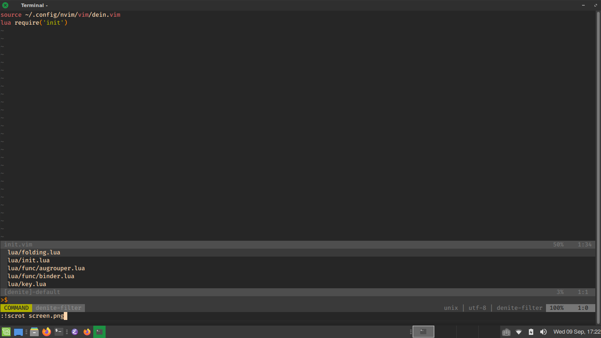

# Neovim Config

- Q: Why is the init.vim file only **2** lines?

    A: Most of the configs are in lua, seperated into different files

- Q: Why is 'package.lua' and 'dein.lua' unused?

    A: Not as fast, nor as easy as dein in VimL

- Q: Why both org-mode and vimwiki?

    A: Because I'm transferring my vimwiki files to Emac's org-mode

